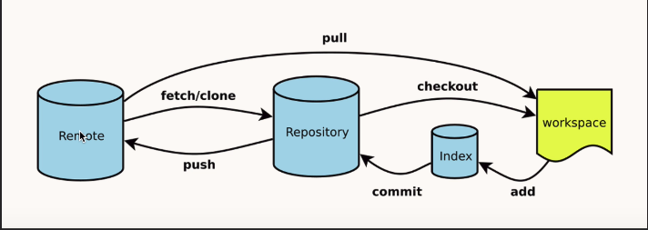
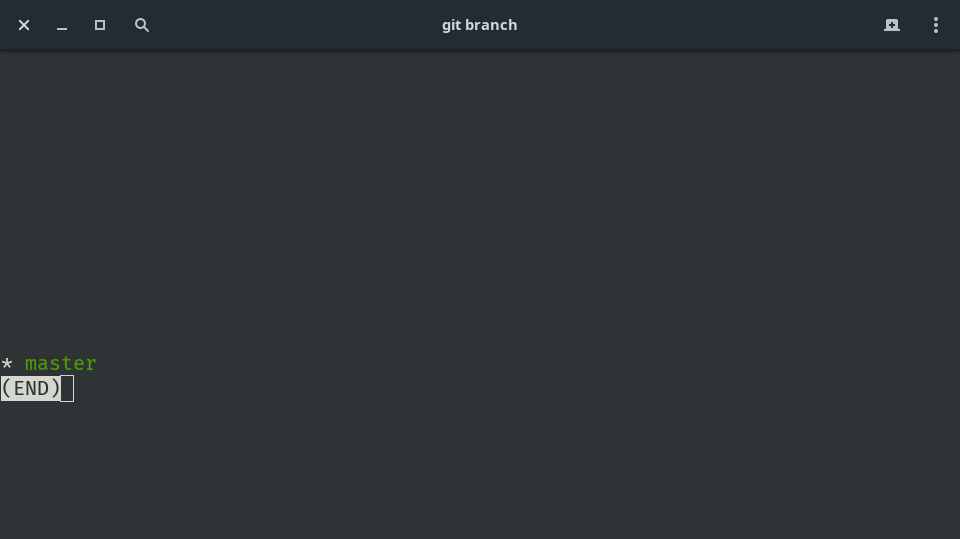
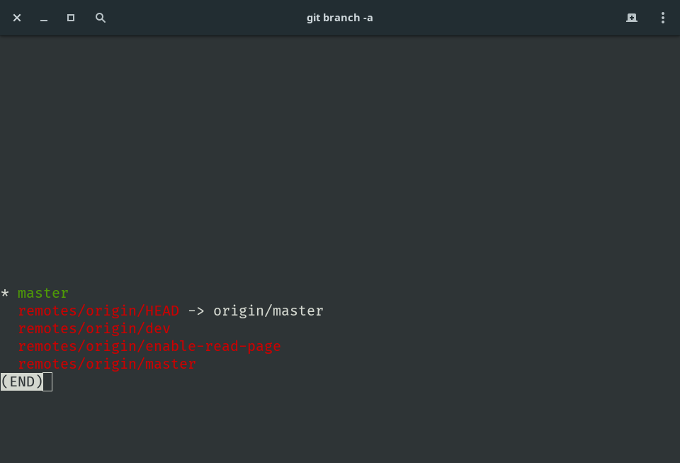
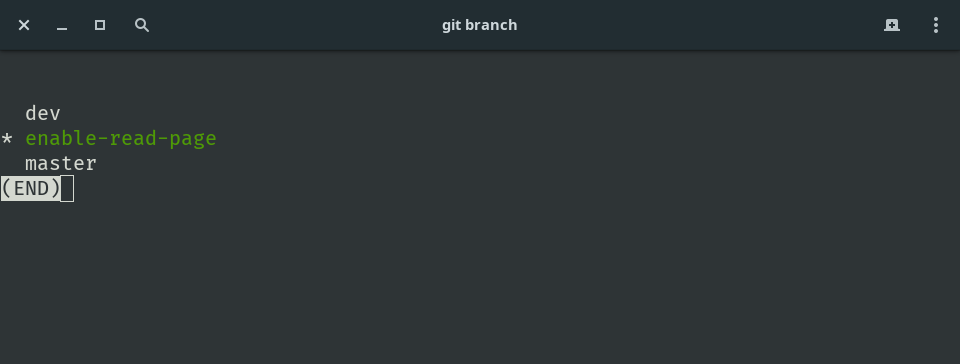

# 远程仓库相关





### 与远程仓库建立连接

`git remote add origin git@github.com:XXX/xxx.git`

### 新建并切换本地分支

`git checkout -b dev`

### 将本地分支push到远程服务器

`git push origin dev:dev`

### 删除指定远程分支

有两种方法：

1. 推送一个空分支到远程分支（相当于删除远程分支）

   `git push origin:dev`

2. 删除命令

   `git push origin --delete dev`

### 查看所有分支（包括远程分支）

`git branch -a`

### 合并分支

```bash
git checkout master
git merge --no-ff -m"description" dev
```

以上步骤先切换到master，再把dev分支合并到master，并且**不删除**dev分支。

### 拉取远程分支到本地分支

首先切换到想要拉取同步的本地分支：`git checkout localName`

接着就可以从远程的某个分支拉取过来了：`git pull origin remoteName`


## clone远程所有分支

1. 首先clone相关的远程仓库

   `git clone git@github.com:YeomanLi/funReader.git`

2. 接着我们查看一下仓库的分支：

   `git branch`

   但是发现只有`master`分支：

   

   这是因为其他分支在我们的仓库中是隐藏的，所有我们只能看到master分支

3. 给查看命令加上`-a`选项来显示隐藏分支：

   `git branch -a`

   

   这个时候就可以看到所有分支了

4. 如何在当前分支工作？

   光看是不够用的，如果我们想要在当前分支工作呢？

   好办，我们可以：

   `git checkout -b xxx origin/xxx`

   其中xxx就是所要工作的远程分支

   或者我们可以：

   `git checkout -t origin/xxx`

   两者等效

   

