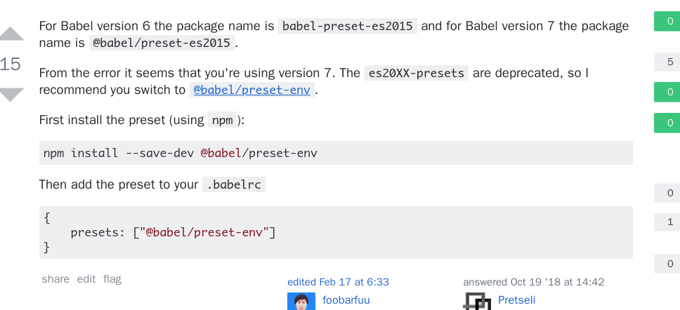

# Vue按需引入element-UI

> 官网虽然给出了按需引入的例子，但是那是version6的Babel了，我们至今最新的vue-cli已经不用这个了
>
> 

## 安装preset

```bash
cnpm i --save-dev @babel/preset-env
```


## 配置`babel.config.js`

```javascript
module.exports = {
  presets: [
    '@vue/app',
    // ["es2015", { "modules": false }]
    ["@babel/preset-env"]
  ],

  plugins: [
    [
      "component",
      {
        "libraryName": "element-ui",
        "styleLibraryName": "theme-chalk"
      }
    ]
  ]
}
```

## 在`main.js`中按需引入

```javascript
import { Form, FormItem, Input, Select, Option, Button, Row } from 'element-ui'

Vue.component(Button.name, Button)
Vue.component(Form.name, Form)
Vue.component(Row.name, Row)
Vue.component(FormItem.name, FormItem)
Vue.component(Input.name, Input)
Vue.component(Select.name, Select)
Vue.component(Option.name, Option)
// Vue.use(Button)
```


## StackOverFlow截图

