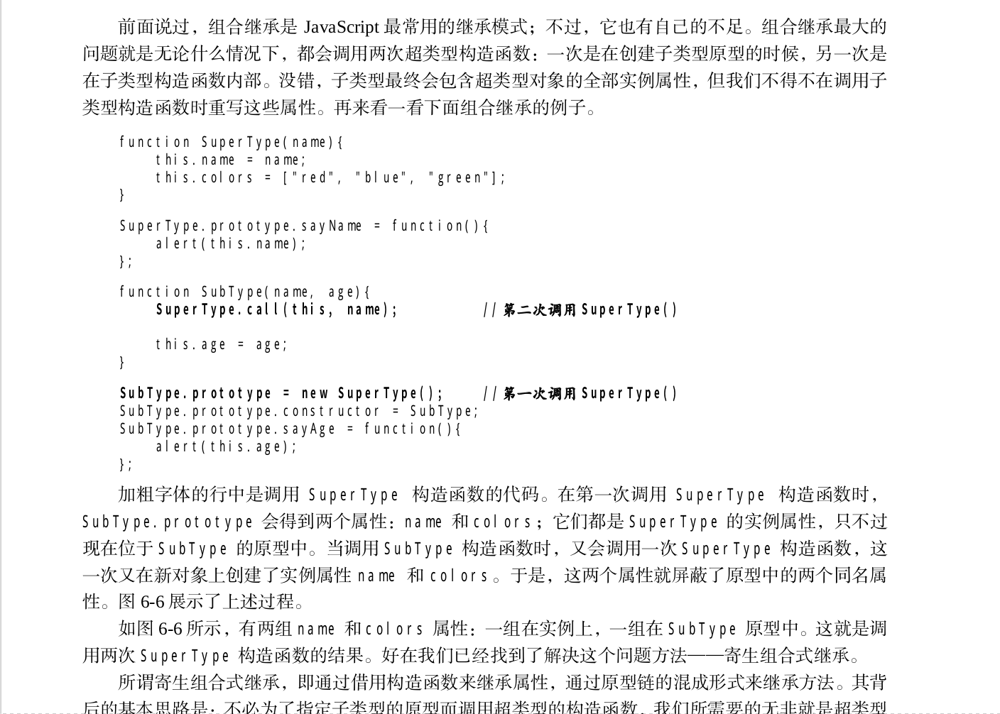

# Chapter-6 继承

## 确定原型和实例的关系

- `instanceof`：只要用这个操作符来测试实例与原型中出现过的**构造函数**，都会返回`true`
- `isPrototypeOf`：只要原型链中出现的**原型**，都会返回`true`


## 重写超类中的方法并不会改变影响超类原型本身的方法

```javascript
function SuperType () {
  this.property = true
}

SuperType.prototype.getSuperValue = function () {
  // return this.property
  return true
}

function SubType () {
  this.subproperty = false
}

SubType.prototype = new SuperType()

SubType.prototype.getSuperValue = function () {
  return false
}

const instance = new SuperType()
console.log(instance.getSuperValue()) // true
```

但是**重写一定要放在替换原型之后**


## 谨慎使用字面量构造方法

```javascript
function SuperType () {
  this.property = true
}

SuperType.prototype.getSuperValue = function () {
  // return this.property
  return true
}

function SubType () {
  this.subproperty = false
}

SubType.prototype = new SuperType()

SubType.prototype = {
  getSubValue: function () {
    return this.subproperty
  },

  someOtherMethod: function () {
    return false
  }
}

const instance = new SubType()
console.log(instance.getSuperValue()) //  error
```

报错是因为刚刚把`SuperType`的实例赋值给原型，现在又将原型替换为一个字面量对象，所以现在原型包含的是一个`Object`的实例，切断了`SubType`和`SuperType`之间的原型链关系。


## 原型链继承的缺陷

1. 包含引用类型值的原型

   ```javascript
   function SuperType () {
     this.data = [1, 2, 3]
   }
   
   function SubType () { }
   SubType.prototype = new SuperType()
   
   const instance1 = new SubType()
   instance1.data.push(4)
   console.log(instance1.data) //  [ 1, 2, 3, 4 ]
   
   const instance2 = new SubType()
   console.log(instance2.data) //  [ 1, 2, 3, 4 ]
   ```

   可以看到，`instance1`中对`data`数组（引用类型）的改变会影响到`instance2`

   > 包含引用类型的值的原型属性会被所有实例共享。而我们通过原型来实现继承时，原型实际上会变成另一个类型的实例。于是，原先的实例属性也顺理成章地变成了现在的原型属性了。

   

2. 不能向构造函数传递参数


## 借用构造函数继承

```javascript
function SuperType (str) {
  this.data = [1, 2, 3],
  this.str = str
}

function SubType (name) {
  SuperType.call(this, name)
}

const instance1 = new SubType('instance1')
instance1.data.push(4)
console.log(instance1)  //  SubType { data: [ 1, 2, 3, 4 ], str: 'instance1' }

const instance2 = new SubType('instance2')
console.log(instance2)  //  SubType { data: [ 1, 2, 3 ], str: 'instance2' }

```

### 优点

- 一个实例不会改变同一原型其他实例中的引用类型值
- 创建实例可以传递参数

### 缺陷

- 方法都在构造函数中定义，不能函数复用。
- 超类型的原型定义的方法，对子类而言是看不见的。


## 组合继承

### 思路概括

使用原型链实现对原型属性和方法的继承，而通过借用构造函数来实现对实例属性的继承。

这样，既能通过在原型上定义方法实现了函数复用，又能够保证每个实例都有它自己的属性。


### 示例

```javascript
// 组合继承
function Person (name) {
  this.name = name
  this.play = [1, 2, 3]
}

Person.prototype.sayName = function () {
  console.log(this.name)
}

function Student (name, age) {
  Person.call(this, name)
  this.age = age
}

Student.prototype = new Person()
Student.prototype.constructor = Student
Student.prototype.sayAge = function () {
  console.log(this.age2)
}

const s1 = new Student('Yeoman', 21)
const s2 = new Student('LYM', 17)
s1.play.push(4)

console.log(s1.play)  //  [ 1, 2, 3, 4 ]
console.log(s2.play)  //  [ 1, 2, 3]

s1.sayName()  //  Yeoman
s2.sayName()  //  LYM
```


### 缺陷




## 寄生组合继承

### 示例

```javascript
// 寄生组合继承
function inheritPrototype(subType, superType) {
  const prototype = Object(superType.prototype)
  prototype.constructor = subType
  subType.prototype = prototype
}

function Person (name) {
  this.name = name
  this.play = [1, 2, 3]
}

Person.prototype.sayName = function () {
  console.log(this.name)
}

function Student (name, age) {
  Person.call(this, name)
  this.age = age
}

inheritPrototype(Student, Person)
Student.prototype.sayAge = function () {
  console.log(this.age)
}

const s1 = new Student('Yeoman', 21)
const s2 = new Student('LYM', 17)
s1.play.push(4)

console.log(s1.play)  //  [ 1, 2, 3, 4 ]
console.log(s2.play)  //  [ 1, 2, 3]

s1.sayName()  //  Yeoman
s2.sayName()  //  LY
```

