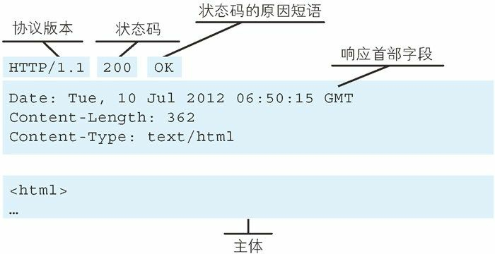
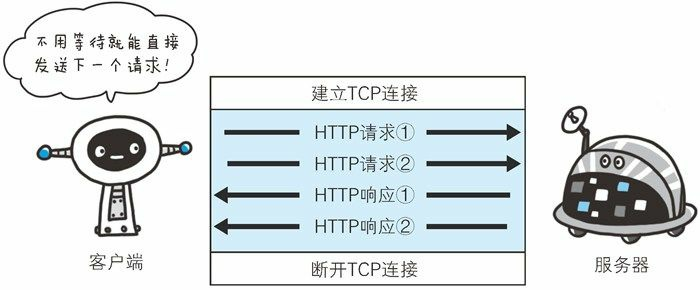
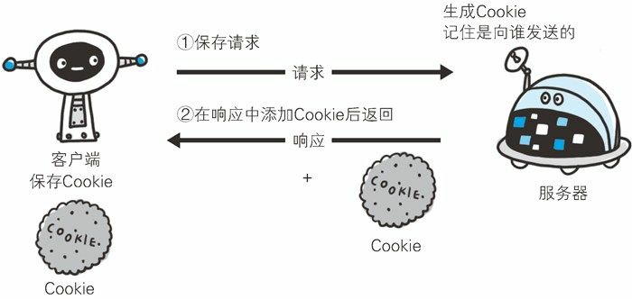
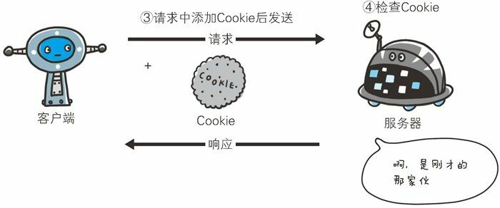

# 《图解HTTP》Chapter-2

**请求报文：** 

**响应报文：** 

HTTP是无状态的协议： 每当有新的请求发送时，就会有对应的新响应产生。协议不保留之前一切的请求或者响应的信息。*这是为了能够更快地处理大量事务。*

HEAD： 获得报文首部

> HEAD和GET方法一样，*只是不返回报文主体部分。*用于确认URI的有效性及资源更新的日期和时间等。

## 持久连接

> 在HTTP协议初始版本中，每进行一次HTTP通信就要断开一次TCP连接。当请求的文档中有大量资源（比如大量图片）时，每次的请求会造成无谓的TCP连接建立和断开，增加通信的开销。

为了解决以上问题，HTTP/1.1（也有少部分的1.0）提出了持久连接的方法：只要任意一端没有明确提出断开连接，TCP保持连接状态。**HTTP/1.1中，默认持久连接 **

持久连接的好处：

- 减少了TCP连接的重复建立和断开所造成的额外开销，减轻了服务器的负载。
- 减少了开销，页面的显示速度提高了（HTTP请求和相应能够提前结束）。

## 管线化

## 使用Cookie的状态管理

流程：

1. 没有Cookie信息下客户端发送请求
2. 服务器生成Cookie，记住是向谁发送的
3. 服务器在响应报文中添加Set-Cookie首部字段
4. 客户端下次发送的请求中会包含Cookie的信息状态
5. 服务器发现客户端发来的Cookie后，会检查究竟是哪个客户端发来的请求，然后对比服务器上的记录，最后得到之前的状态信息

- 没有Cookie信息状态下的请求

  

- 第2次以后（存有Cookie信息状态）的请求

  