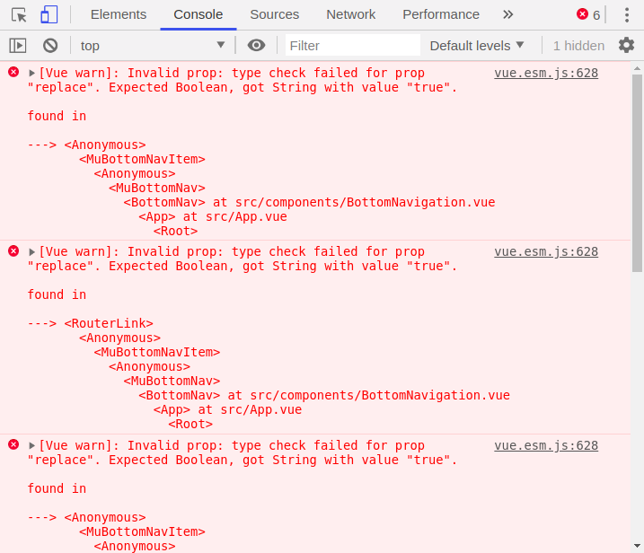
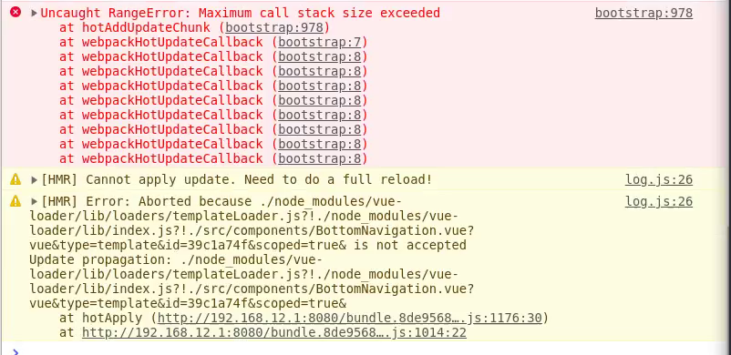
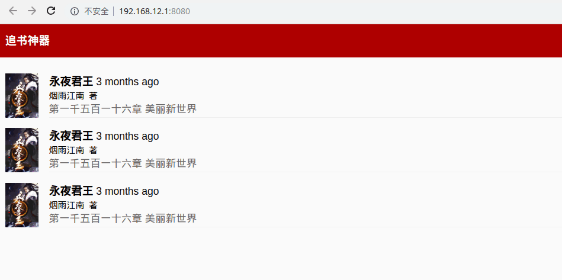

# 小说webapp开发之路

## Muse-UI底部导航栏遇到的问题

### 使用fontawesome图标

首先在`index.html`中引入字体库的cdn，接着只要修改导航栏中的icon属性，使用冒号（：）来标记是第三方图标，例如：

`<mu-bottom-nav-item title="书架" to="/" :replace=replacePath icon=":fa fa-book-open"></mu-bottom-nav-item>`


### 路由切换不记录历史

Muse-UI的导航栏默认的是记录历史的，这就导致了这样的bug：用户手机左右滑动手机屏幕，有些移动端浏览器会跳转路由，此时显然是没有触发单击事件的，所以会出现导航栏高亮的图标和当前页面不匹配的现象。

为了方便省事，我们可以简单粗暴地设置`replace`属性为`true`，这样，就不会记录历史记录了，见：<https://muse-ui.org/#/zh-CN/bottom-navigation>

虽然我们设置了`replace`为`tue`，解决了这个问题，当时当我们打开控制台的时候，发现控制台报错了：



网上找了一圈下来，没发现解决方案，只好采取折中的方案，使用`v-bind`动态给`replace`设值，在`data`中写好为`true`就行了。


## 开发书架

### 左滑删除功能

<https://cn.vuejs.org/v2/guide/custom-directive.html>

<https://cloud.tencent.com/developer/article/1174737>

<https://segmentfault.com/a/1190000013922322>

<https://blog.csdn.net/qq_17757973/article/details/78112976>


### 下滑加载

<https://juejin.im/entry/583581ef570c35005e411c9a>


## 配置

### `regeneratorRuntime is not defined`

在methods中使用`async/await`发现报这个错误，经过网上查找之后，是因为项目中的babel没有使用`transform-runtime`将es6转换为es5

所以，我们只需安装这个插件并且在自己的`.babelrc`文件中添加这个插件。

**需要注意的是，我的项目中用的是7.0以上的babel，所以安装的时候要在前面加上前缀**

`npm i @babel/plugin-transform-runtime -D`

接着修改配置文件：

```javascript
"plugins": [
    ["@babel/plugin-transform-runtime"]
]
```


## webpack相关

### 热更新异常

我发现当我按照网上的文档在自己的`webpack.dev.conf.js`中同时配置`hot: true`、添加`HotModuleReplacementPlugin`插件时，每次更改样式或者单页文件时，每次都是报错然后强制性刷新。控制台报错如下（由于强制性刷新，为了截这张图我是开OBS录屏然后暂停截图的）：



后来我只能将`HotModuleReplacementPlugin`这个插件关掉，接着就正常了。

暂时不知道原因。


### 刷新页面404

我发现我只能刷新首页，当我刷新除去首页的其他页面时，都会报错：



我一开始是以为自己的webpack配置有问题，经过半天的排查之后，并没有发现什么大的问题，经过网上搜索发现是**Vue路由设置为history模式导致的**。具体原因见官网：

🔗[https://router.vuejs.org/zh/guide/essentials/history-mode.html#%E5%90%8E%E7%AB%AF%E9%85%8D%E7%BD%AE%E4%BE%8B%E5%AD%90](https://router.vuejs.org/zh/guide/essentials/history-mode.html#后端配置例子)

思否：<https://segmentfault.com/q/1010000008158341/>

但是官网只是给出了后端配置的例子，经查前端暂时只发现设置webpack配置里面的`historyApiFallback`来重定位，但是我自己用这种方法依然是不行。

最终只好不用history模式了。